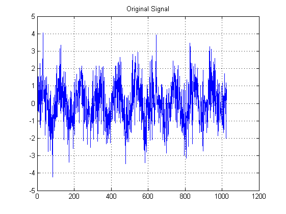
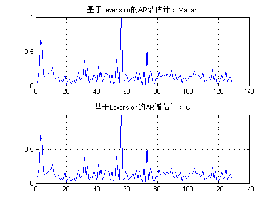

## 功能介绍

1. zx_fft.c/h实现了FFT功能（包括实数FFT）
2. mem_alloc.c/h中包含了内存管理功能，参考uCOS II移植过来，方便嵌入式应用（ar_model.c中多处调用）
3. zx_correl.c/h用定义实现了互相关（定义的实现方法其实效率很低，我在[Github/FFT]提供了使用FFT计算互相关函数的C代码）
4. ar_model.c/h中使用Levinson方法及FFT实现了PSD随机信号的功率谱估计
5. test_mem_alloc.c/h提供了一个使用参考实例

本例程用C和Matlab实现了PSD功率谱的计算，并通过Matlab绘制了Matlab与C计算结果的对比：




## 使用方法

- 运行wave_to_c.m程序，选择*.wav文件，执行后将音频数据写入到testcase.h头文件文件
- 执行Makefile编译C程序，运行将执行结果重定位到了a.txt文件（gcc版本3.4.4）
    ```
	make
	make run
    ```
- 执行disp_result.m查看C计算的结果与Matlab计算功率谱结果的对比


## 作者信息

<xiahouzuoxin@163.com>

University of Science and Technology Beijing(USTB), MICL.


[Github/FFT]:https://github.com/xiahouzuoxin/fft
